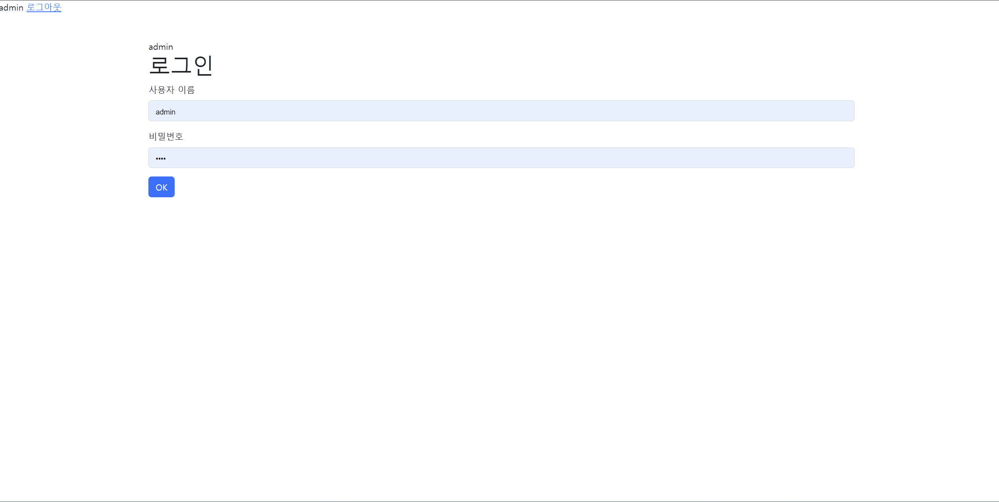

# pair-programming_04 : 로그인/로그아웃 기능이 있는 글/댓글 CRUD 게시판

## 🧩 기간

221022~221023

 

## 🧩 목표

**각자 브랜치를 만들어서 기능들을 구현 후 병합**

> 이쁘게 꾸미진 못하고 일단 기능만 구현함

1. CRUD 기능
   - 영화 리뷰를 작성할 수 있는 게시판 기능 완성
2. 로그인/회원가입 
   - 로그인 및 회원가입 기능 구현
   - 글 삭제 및 수정은 로그인이 되었을 때만 가능하도록 함
     - 로그인이 되어 있지 않다면 login 페이지로 가도록 함
3. 댓글
   - 각각의 리뷰 글에 댓글을 작성하도록 함 (1:N relationship)
   - 댓글 작성은 로그인이 되었을 때만 가능하도록 함
     - 로그인이 되어 있지 않다면 login 페이지로 가도록 함

 

## 🧩 사용 기술

HTML

CSS

Python

Django

 

## 🧩 프로젝트 결과 완성본

### 🧩 참여자들

### 🧩 후기

✔️ 김문경 : 마지막 페어인 만큼 이제까지 배운 기능들을 다 합쳐서 만들어보는 시간이었는데, 여전히 댓글 및 회원기능은 어렵다고 느꼈다. 팀원들과 같이 에러를 고치고 merge 후 conflict 해결 부분이 제일 인상깊었다. merge 에러라고 하면 막연한 두려움이 있었는데 실제로 같이 수정해보니 퍼즐을 한개씩 맞추는 것 처럼 재미가 있었다.

✔️ 김준환 : 

✔️ 여다영 : 각자 브랜치를 나누어서 작업 후, 병합하니까 확실히 시간이 적게 걸리는 게 느껴졌다. 마지막 페어인데 시간이 적어서 이쁘게 못 꾸민게 아쉽다 ㅜ 그래도 다같이 열심히 해서 재미있었다 ㅎㅎ